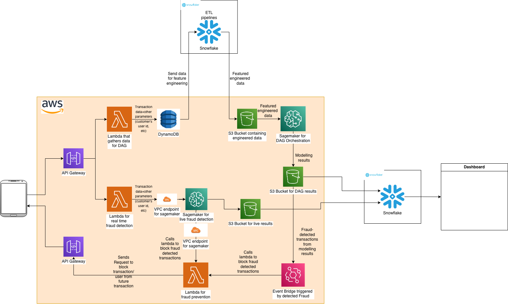

# Mobile Transaction Fraud Detection System

A comprehensive machine learning solution for detecting fraudulent financial mobile transactions, combining exploratory data analysis, feature engineering, and multiple machine learning models (Logistic Regression, Neural Networks, XGBoost, and Stacking Ensemble).

Data: [Kaggle Mobile Transaction Dataset](https://www.kaggle.com/datasets/ealaxi/paysim1)

PLEASE DOWNLOAD AND UNZIP THE FOLLOWING BEFORE YOU START IF YOU WANT TO JUST VIEW THE FULL DATA AND NOT RUN THE PIPELINE: [data.zip](https://drive.google.com/file/d/1KOAAtgmr_Rtt8NkEEEa_dDN3yqgkiR7j/view?usp=drive_link)

**Note:** Very important to do so if pipeline not ran to view networkx plots on streamlit

THIS IS IMPT IF U WANT TO VIEW THE STREAMLIT NETWORKX VISUALISATION

---

## 📋 Table of Contents

- [Overview](#overview)
- [Project Structure](#project-structure)
- [Getting Started](#getting-started)
- [Jupyter Notebooks Workflow](#jupyter-notebooks-workflow)
- [Streamlit Interactive Application](#streamlit-interactive-application)
- [Models & Performance](#models--performance)
- [Docker Deployment](#docker-deployment)
- [Production Deployment & System Integration](#production-deployment--system-integration)
- [Installation](#installation)
- [Usage](#usage)

---

## 🎯 Overview

This project implements an end-to-end fraud detection pipeline that:

- **Explores** financial transaction data with statistical analysis and visualization
- **Engineers** features to improve model performance
- **Trains** multiple machine learning models with different algorithms
- **Compares** model performance and selects the best approach
- **Deploys** an interactive Streamlit application for real-time predictions
- **Visualizes** fraud networks using graph analysis

### Key Features

- ✅ Multi-model comparison (Logistic Regression, Neural Networks, XGBoost, Ensemble)
- ✅ Imbalanced data handling with resampling techniques
- ✅ Interactive Streamlit dashboard for exploration and predictions
- ✅ Network graph visualization for fraud patterns
- ✅ Docker containerization for easy deployment
- ✅ Support for both merchant and non-merchant datasets

### System Architecture

The system follows a comprehensive pipeline from data ingestion through model deployment:

```
┌─────────────────────────────────────────────────────────────────┐
│                   Data Sources & Processing                     │
├─────────────────────────────────────────────────────────────────┤
│  • Raw Financial Transactions                                   │
│  • Feature Engineering (Jupyter Notebooks)                      │
│  • Data Splitting & Resampling                                  │
└────────────────────┬────────────────────────────────────────────┘
                     │
                     ▼
┌─────────────────────────────────────────────────────────────────┐
│              Model Training & Development                       │
├─────────────────────────────────────────────────────────────────┤
│  ┌──────────────────────────────────────────────────────────┐   │
│  │ • Logistic Regression (Baseline)                         │   │
│  │ • Neural Networks (Deep Learning)                        │   │
│  │ • XGBoost (Gradient Boosting)                            │   │
│  │ • Stacking Ensemble (Meta-Learner)                       │   │
│  └──────────────────────────────────────────────────────────┘   │
└────────────────────┬────────────────────────────────────────────┘
                     │
                     ▼
┌─────────────────────────────────────────────────────────────────┐
│          Interactive Streamlit Application                      │
├─────────────────────────────────────────────────────────────────┤
│  • EDA & Hypothesis Validation                                  │
│  • Feature Importance Analysis                                  │
│  • Model Comparisons & Results                                  │
│  • Live Fraud Prediction Interface                              │
│  • Network Visualization & Analytics                            │
└────────────────────┬────────────────────────────────────────────┘
                     │
                     ▼
┌─────────────────────────────────────────────────────────────────┐
│              Docker Containerization & Deployment               │
├─────────────────────────────────────────────────────────────────┤
│  • Containerized Application                                    │
│  • Volume Mounting for Data & Models                            │
│  • Resource-Optimized Configuration                             │
└─────────────────────────────────────────────────────────────────┘
```

---

## 📁 Project Structure

```
DSA4263/
├── notebooks/                          # Jupyter notebooks for development
│   ├── 0_EDA.ipynb                    # Exploratory Data Analysis
│   ├── 1a_train_test_val_split.ipynb  # Data splitting
│   ├── 1b_Resampling.ipynb            # Handling class imbalance
│   ├── 2_Feature_Engineering_Pipeline.py  # Feature engineering script
│   ├── 3_Logistic_Regression.ipynb    # Logistic Regression model
│   ├── 4_Neural_Network.ipynb         # Deep Learning model
│   ├── 5_XGBoost.ipynb                # Gradient Boosting model
│   ├── 6_Ensemble_Model.ipynb         # Stacking Ensemble model
│   └── ...                            # Additional experiments
│
├── src/                               # Streamlit application
│   ├── app.py                         # Main app entry point
│   └── pages/
│      ├── 2_EDA_Hypotheses.py       # Data exploration dashboard
│      ├── 3_Feature_Engineering_Hypotheses.py  # Feature analysis
│      ├── 4_Network_Explorer.py                # Fraud network visualization
│      ├── 5_Logistic_Regression_Results.py     # LR model results
│      ├── 6_XGBoost_Results.py                 # XGBoost model results
│      ├── 7_Neural_Network_Results.py          # Neural Network results
│      ├── 8_Stacking_Ensemble_Model.py         # Ensemble model results
│      ├── 9_Model_Comparison.py                # All models comparison
│      ├── 10_Explainable_AI.py                 # Explainable AI of XGBoost
│      └── 11_Live_Fraud_Prediction.py          # Live predictions with XGBoost
│
├── data/                              # Data directories
│   ├── raw/                           # Original datasets
│   ├── splits/                        # Train/test/val splits
│   └── FEwithMerchants/              # Feature-engineered data
│       └── FEwithoutMerchants/
│
├── models/                            # Trained model files
│   ├── XGB/                           # XGBoost models
│   ├── NN/                            # Neural Network models
│   └── validation_results_summary.csv
│
├── plots/                             # Generated visualizations for streamlit
│   ├── logistic_regression_metrics.csv
│   ├── neural_network_metrics.csv
│   ├── stacking_ensemble_metrics.csv
│   ├── fraud_network.html
|   └── Other plots generated from notebooks for streamlit display
│
├── Dockerfile                         # Docker configuration
├── docker-compose.yml                 # Docker compose setup
├── .dockerignore                      # Docker build exclusions
├── setup-docker-data.sh              # Data preparation script
├── run_notebooks.sh                  # Automated notebook execution script
├── requirements.txt                   # Python dependencies
└── README.md                          # This file
```

---

## 🚀 Getting Started

### Prerequisites

- Python 3.11+
- pip or conda
- (Optional) Docker and Docker Compose for containerized deployment

### Installation

1. **Clone the repository:**
   ```bash
   git clone https://github.com/jl5045/DSA4263.git
   cd DSA4263
   ```

2. **Create a virtual environment:**
   ```bash
   python -m venv venv
   source venv/bin/activate  # On Windows: venv\Scripts\activate
   ```

3. **Install dependencies:**
   ```bash
   pip install -r requirements.txt
   ```

---

## 📓 Jupyter Notebooks Workflow

The notebook workflow is organized sequentially for a complete development pipeline:

### Phase 1: Data Preparation
- **`0_EDA.ipynb`** - Exploratory Data Analysis
  - Load and inspect raw data
  - Statistical summaries and distributions
  - Identify missing values and anomalies
  - Visualize fraud vs. legitimate transactions

- **`1a_train_test_val_split.ipynb`** - Data Splitting
  - Split data into train/validation/test sets
  - Maintain fraud class distribution across splits
  - Generate `data/splits/` CSV files

- **`1b_Resampling.ipynb`** - Handling Class Imbalance
  - Explore resampling techniques (oversampling, undersampling, SMOTE)
  - Create downsampled datasets (1:5 and 1:10 ratios)
  - Compare class distributions

### Phase 2: Feature Engineering
- **`2_Feature_Engineering_Pipeline.py`** - Feature Engineering Script
  - Create derived features from transaction attributes
  - Normalize and scale features
  - Select relevant features
  - Generate datasets in `data/FEwithMerchants/` and `data/FEwithoutMerchants/`

### Phase 3: Model Development

#### 3a. **`3_Logistic_Regression.ipynb`**
- Baseline model for comparison
- Train logistic regression classifier
- Evaluate with precision, recall, F1-score, ROC-AUC, PR-AUC
- Save metrics to `plots/logistic_regression_metrics.csv`

#### 3b. **`4_Neural_Network.ipynb`**
- Build and train deep neural network
- Experiment with different architectures
- Save trained model to `models/NN/NN_1to5_all.keras` and `NN_1to10_all.keras`
- Generate performance metrics

#### 3c. **`5_XGBoost.ipynb`**
- Gradient boosting implementation
- Hyperparameter tuning with cross-validation
- Save models to `models/XGB/best_xgb_1to5_*.json` and `best_xgb_1to10_*.json`
- Evaluate feature importance

#### 3d. **`6_Ensemble_Model.ipynb`**
- Stacking ensemble combining multiple models
- Meta-learner training
- Performance comparison with individual models
- Save results to `plots/stacking_ensemble_metrics.csv`

### Running Notebooks

You have three options to run the notebooks:

**Option 1: Run All Notebooks Automatically (Recommended for First Time)**
```bash
# Install dependencies first (if not done already)
pip install -r requirements.txt

# Execute entire pipeline in correct order
chmod +x run_notebooks.sh
./run_notebooks.sh
```
This script will:
1. Run all notebooks sequentially (0_EDA → 1a_train_test_val_split → 1b_Resampling → Feature Engineering → Models)
2. Execute the feature engineering Python script
3. Train all models (Logistic Regression, Neural Network, XGBoost, Ensemble)
4. Generate all necessary outputs for the Streamlit app

⚠️ **Note:** 
- This can take a significant amount of time (30+ minutes depending on your machine)
- Requires `jupyter` and `nbconvert` (included in requirements.txt)
- If you encounter errors, you can run notebooks individually (see Option 2)

**Option 2: Run Notebooks Manually in Jupyter Lab**
```bash
jupyter lab
```
Navigate to `notebooks/` and run notebooks in this order:
1. `0_EDA.ipynb` - Exploratory Data Analysis
2. `1a_train_test_val_split.ipynb` - Data Splitting
3. `1b_Resampling.ipynb` - Class Imbalance Handling
4. `2_Feature_Engineering_Pipeline.py` - Feature Engineering (run as Python script)
5. `3_Logistic_Regression.ipynb` - Baseline Model
6. `4_Neural_Network.ipynb` - Deep Learning Model
7. `5_XGBoost.ipynb` - Gradient Boosting Model
8. `6_Ensemble_Model.ipynb` - Stacking Ensemble

**Option 3: Run in VS Code**
- Install Jupyter extension in VS Code
- Open `.ipynb` files directly and run cells in the order listed above

---

## 🎨 Streamlit Interactive Application

The Streamlit app provides an interactive dashboard for exploring results and making predictions.

### Running the App

**Recommended: Docker Deployment (Easiest)**

The simplest way to run the Streamlit app is using Docker, which handles all data and dependencies automatically:

```bash
# Download data.zip from the link at the top of this README and unzip into root directory

# Run the application
docker-compose up --build
```

The app will open at `http://localhost:8501`

**No additional setup needed** - Docker automatically extracts the data and configures everything!

See the [Docker Deployment](#-docker-deployment) section below for more details and advanced options.

---

**Alternative: Local Development (Advanced)**

For local development without Docker:

⚠️ **Prerequisites:**
- If you **have not** run the full notebook pipeline, you must manually extract the data:
  1. Download [data.zip](https://drive.google.com/file/d/1KOAAtgmr_Rtt8NkEEEa_dDN3yqgkiR7j/view?usp=drive_link)
  2. Extract it in the repository root: `unzip data.zip`
  3. This creates the `data/` folder with all necessary datasets

- If you **have** run the full pipeline, the `data/` directory already exists with feature-engineered datasets

```bash
# Ensure dependencies are installed
pip install -r requirements.txt

# Run Streamlit locally
streamlit run src/app.py
```

The app will open at `http://localhost:8501`

### Available Pages

#### **Page 2: EDA Hypotheses** (`2_EDA_Hypotheses.py`)
- Visual validation of key data hypotheses
- Transaction type fraud concentration analysis
- Transaction amount patterns for fraud vs. legitimate
- Top senders analysis
- Multicollinearity detection using VIF (Variance Inflation Factor)
- Displays precomputed plots from `plots/` directory

#### **Page 3: Feature Engineering Hypotheses** (`3_Feature_Engineering_Hypotheses.py`)
- Visual validation of feature engineering decisions
- Feature importance analysis
- Feature correlation and relationship visualization
- Engineering approach effectiveness demonstration
- Displays precomputed plots from `plots/` directory

#### **Page 4: Network Explorer** (`4_Network_Explorer.py`)
- Interactive fraud network visualization
- Node connections between accounts and merchants
- Dataset selection (with/without merchants, various downsampling ratios)
- Graph analytics to identify fraud patterns
- Memory-efficient data loading with cache clearing option

#### **Page 5: Logistic Regression Results** (`5_Logistic_Regression_Results.py`)
- Baseline model performance metrics (F1-score, PR-AUC, ROC-AUC)
- Confusion matrix visualization
- ROC curve and PR curve comparisons
- Model interpretation for fraud detection
- "How to read this plot" sections for clarity
- Displays precomputed plots from `plots/` directory

#### **Page 6: XGBoost Results** (`6_XGBoost_Results.py`)
- Gradient boosting model performance metrics
- Confusion matrix and performance evaluation
- Feature importance analysis
- ROC and PR curve visualizations
- Model interpretation and predictions
- "How to read this plot" explanations
- Displays precomputed plots from `plots/` directory

#### **Page 7: Neural Network Results** (`7_Neural_Network_Results.py`)
- Deep learning model performance metrics
- Training history and convergence analysis
- Standard feature importance vs. SHAP feature importance
- Confusion matrix and performance curves
- Complex pattern capture validation
- "How to read this plot" explanations
- Displays precomputed plots from `plots/` directory

#### **Page 8: Stacking Ensemble Model** (`8_Stacking_Ensemble_Model.py`)
- Best-performing ensemble combining multiple base models
- Performance comparison: Ensemble vs. individual models (e.g., 1.75x better than Neural Network)
- Individual model contributions analysis
- Meta-learner results and effectiveness
- "How to read this plot" interpretability sections
- Displays precomputed plots from `plots/` directory

#### **Page 9: Model Comparison** (`9_Model_Comparison.py`)
- Side-by-side performance metrics for all four models
- Comprehensive metrics table (F1, PR-AUC, ROC-AUC, etc.)
- XGBoost highlighted as best single model
- Model selection guidance with metric-based justification
- Loads metrics automatically from all model result files

#### **Page 10: Explainable AI** (`10_Explainable_AI.py`)
- SHAP-based model explainability for XGBoost
- Global feature importance (bar plot and beeswarm plot)
- Individual prediction explanations (waterfall and force plots)
- Interactive HTML visualizations
- Key insights and interpretation guidance
- Displays SHAP plots from `plots/` directory

#### **Page 11: Live Fraud Prediction** (`11_Live_Fraud_Prediction.py`)
- Real-time fraud probability predictions using XGBoost model
- Two modes: sample dataset or CSV file upload
- Batch prediction on multiple transactions
- Risk classification (High/Medium/Low)
- Results table with fraud probability and risk level
- Summary statistics by risk level
- CSV export of predictions
- Complete feature set (56 engineered features)

---

## 🏆 Models & Performance

The project implements and compares four different ML approaches:

| Model | Type | Best Use Case | Key Metric |
|-------|------|---------------|-----------|
| **Logistic Regression** | Linear | Baseline, interpretability | Fast, simple baseline |
| **Neural Network** | Deep Learning | Complex patterns | Improved accuracy with deep learning |
| **XGBoost** | Gradient Boosting | **Best single model** | **High PR-AUC with explainability (SHAP)** |
| **Stacking Ensemble** | Meta-Learner | Resilient performance | Combines strengths for evolving fraud patterns |

### Metrics Tracked
- **Precision:** False positive control
- **Recall:** False negative control
- **F1-Score:** Harmonic mean of precision/recall
- **ROC-AUC:** Overall discrimination ability
- **PR-AUC:** Precision-Recall tradeoff (better for imbalanced data)

**Main Metrics Tracked:**

- PR-AUC, with F1 score as the tie breaker
---

## 🐳 Docker Deployment

Deploy the Streamlit app in a containerized environment. You have **two options** for handling data:

This approach mounts your local `data` folder directly, useful when you've run all notebooks and want to use freshly generated data. (download and unzip into root [data.zip](https://drive.google.com/file/d/1KOAAtgmr_Rtt8NkEEEa_dDN3yqgkiR7j/view?usp=drive_link) if data is not regenerated)

**Prerequisites:**

1. **Prepare data locally:**
   ```bash
   chmod +x setup-docker-data.sh
   ./setup-docker-data.sh
   ```

2. **Build and run using production compose file:**
   ```bash
   docker-compose -f docker-compose.prod.yml up --build
   ```

**How it works:** Selected folders from local `data/` sent to `data-docker/` which is sent to `data/` directory. On subsequent restarts, it detects the existing data and skips extraction.

**Access the app:** `http://localhost:8501`

---

## 🌐 Production Deployment & System Integration

### Real-World System Architecture

This fraud detection system is designed to integrate into a comprehensive financial transaction monitoring pipeline:



The diagram above illustrates how this fraud detection system integrates with production infrastructure:

#### **Data Ingestion & ETL Pipeline**
- **Data Sources:** Real-time transaction data from multiple channels
- **ETL Processing:** Snowflake for data warehousing and transformation
- **API Gateway:** AWS API Gateway routes incoming transaction requests
- **Lambda Functions:** AWS Lambda handles serverless compute for feature engineering and real-time processing

#### **Model Deployment Architecture**
- **Real-Time Fraud Detection:** VPC endpoints for low-latency fraud scoring
  - Incoming transactions → Lambda (data ingestion + feature engineering) → Model inference → Fraud decision
  - Blocks fraudulent transactions immediately at gateway level
- **Weekly Batch DAG Pipeline:** Scheduled weekly orchestration for comprehensive fraud analysis
  - Aggregates all transactions from the past week across multiple customers and merchants
  - Detects fraud patterns and fraud rings using network analysis
  - DynamoDB stores transaction parameters and customer data
  - Snowflake stores raw data and using ETL pipelines, send feature engineered data to S3 bucket
  - S3 buckets maintain engineered features
  - Sagemaker orchestrates weekly model retraining and performance monitoring
  - Generates fraud network visualizations for investigation teams in streamlit dashboard (or any other dashboard like PowerBI or Tableau)

#### **Dashboard & Visualization**
- **Analytics Dashboard:** Snowflake connects to visualization layer
- **Monitoring:** Real-time fraud detection metrics and model performance tracking
- **Actionable Insights:** Fraud network visualization and pattern analysis

---

## 📦 Dependencies

Key Python packages used in this project:

```
pandas              # Data manipulation
numpy               # Numerical computing
scikit-learn        # Machine learning algorithms
xgboost             # Gradient boosting
tensorflow          # Deep learning framework
streamlit           # Web application framework
plotly              # Interactive visualizations
pyvis               # Network graph visualization
networkx            # Network analysis
imbalanced-learn    # Resampling techniques
seaborn             # Statistical visualizations
matplotlib          # Plotting library
```

See `requirements.txt` for complete dependencies.

---

## 💡 Usage Examples

### Train a Model (Jupyter)
```python
# In notebook
import pandas as pd
from sklearn.ensemble import GradientBoostingClassifier

# Load feature-engineered data
X_train = pd.read_csv('data/FEwithMerchants/FE_train_with_merchants.csv')

# Train model
model = GradientBoostingClassifier()
model.fit(X_train.drop('isFraud', axis=1), X_train['isFraud'])
```

### Make a Prediction (Streamlit App)
1. Navigate to "Live Fraud Prediction" page
2. Input transaction features
3. View fraud probability and confidence score

### Explore Network (Streamlit App)
1. Navigate to "Network Explorer" page
2. Interact with the fraud network visualization
3. Identify key merchants and patterns

---

## 🔍 Dataset Information

### Data Sources
- **Primary Dataset:** Synthetic financial transaction dataset
- **Fraud Rate:** Highly imbalanced (minority class fraud)
- **Features:** Transaction amount, merchant info, temporal features, etc.

### Data Variants
- **With Merchants:** Includes merchant category and name
- **Without Merchants:** Merchant features excluded
- **Downsampled:**
  - 1:5 ratio (1 fraud per 5 legitimate)
  - 1:10 ratio (1 fraud per 10 legitimate)

---

## 📊 Results & Metrics

Results are saved in the `plots/` and `models/` directories:

- `plots/logistic_regression_metrics.csv` - Logistic Regression performance
- `plots/neural_network_metrics.csv` - Neural Network performance
- `plots/xgboost_metrics.csv` - XGBoost performance
- `plots/stacking_ensemble_metrics.csv` - Stacking Ensemble performance
- `plots/xgb_shap_*.png` - SHAP explainability plots for XGBoost
- `plots/xgb_shap_force_fraud_example.html` - Interactive SHAP force plot
- `plots/fraud_network.html` - Interactive fraud network visualization
- `models/XGB/best_xgb_1to5_all.json` - Best XGBoost model (1:5 ratio)
- `models/XGB/best_xgb_1to10_all.json` - Best XGBoost model (1:10 ratio)
- `models/NN/NN_1to5_all.keras` - Neural Network model (1:5 ratio)
- `models/NN/NN_1to10_all.keras` - Neural Network model (1:10 ratio)
- `models/validation_results_summary.csv` - Cross-validation summary

---

**Last Updated:** November 2025


